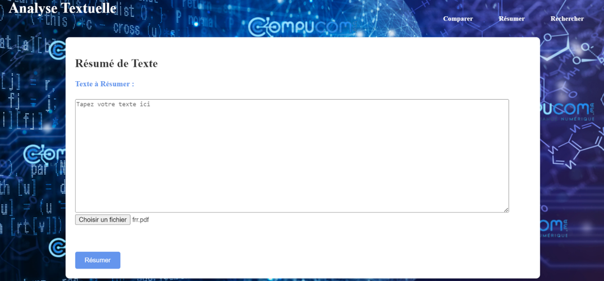
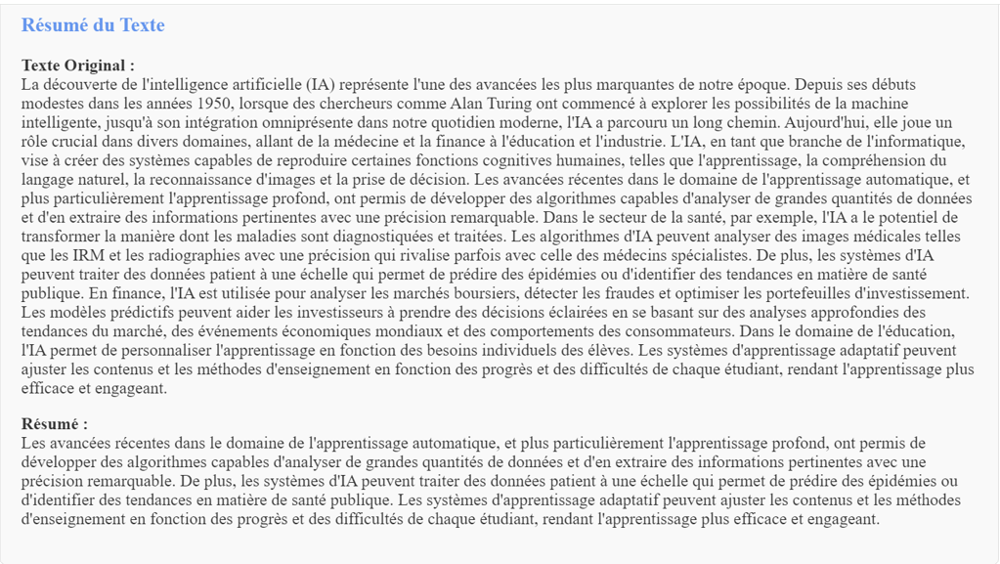
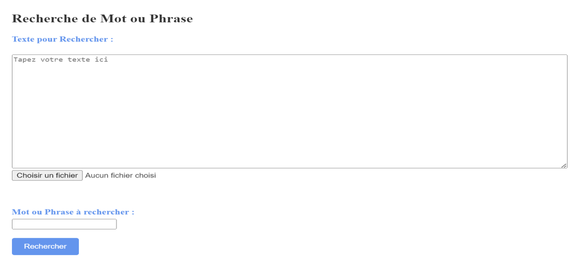
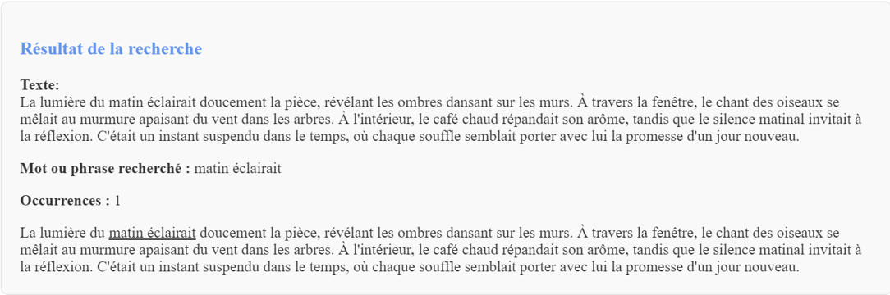

# **Overview :**
This project is a Textual Analysis Application based on Natural Language Processing (NLP). The application integrates various features such as text comparison, summarization,sentiment analysis and text search, designed to help users analyze and work with text data more efficiently. Additionally, users can work with PDF files, comparing, summarizing, and searching directly from them, and generate a PDF report of the analysis results.

# **Features :**
- **Text Comparison**: Compares two input texts, identifies similarities and differences, and performs sentiment analysis to evaluate the emotional tone of the texts. 
- **Text Summarization**: Summarizes lengthy texts, extracting key information. 
- **Text Search**: Allows users to search for specific words or phrases within a given text. 
- **PDF Support**: Upload a PDF file, and the app will allow you to compare, summarize, or search within the content. 
- **PDF Report Generation**: After performing a comparison, the application can generate a PDF report containing the analysis results along with visualizations of the comparisons.

# **Technologies Used :** 
- **Flask**: A lightweight Python web framework used to build the web application. 
- **NLTK**: A library for processing natural language, used for text analysis and comparison. 
- **SpaCy**: Another NLP library used for advanced natural language understanding. 
- **PyPDF2/FPDF** : Libraries for extracting text from PDFs and generating PDFs. 
- **HTML/CSS/JS**: For the front-end design and user interface. 
- **Matplotlib**: For generating graphs and visualizations to represent text comparison results. 

## Usage
1. **Landing Page**: Visit the landing page to explore the available features.
2. **Text Comparison**: Navigate to the comparison page to start comparing two texts.
3. **Summarization**: Access the summarization feature to condense large text blocks into key points.
4. **Search**: Use the search feature to find specific words or phrases in a given text.
5. **PDF Support**: Upload PDF files and perform text analysis directly on them.

## API Documentation
The backend of the application exposes the following API endpoints:

- **POST /compare**: Compare two texts and generate results.
- **POST /summarize**: Summarize the input text.
- **POST /search_word**: Search for specific words or phrases in a text.
- **GET /download_pdf**: Download the PDF report of the comparison .
- **GET /**: Landing page.

# **Demonstration**

